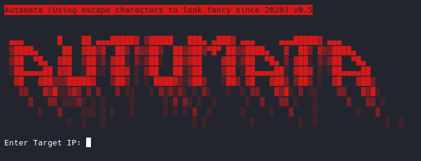
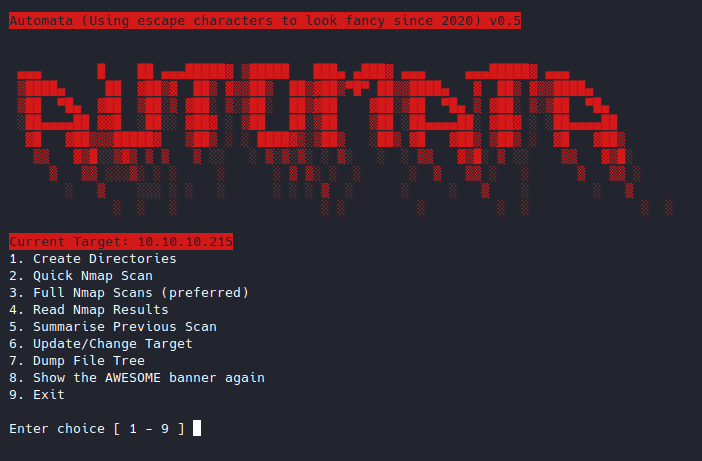
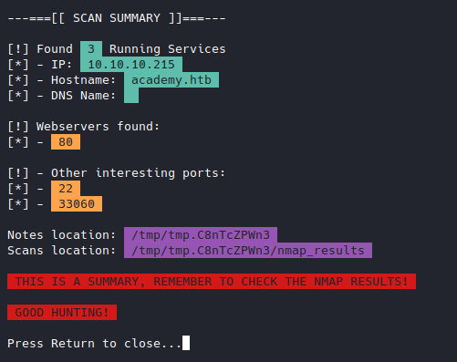

# Automata.sh

Automata.sh is a miniature organisation script that wraps around `nmap` and some BaSH commands to help you focus on testing your target.

*Requirements:*

- Basic Linux System
- `nmap`

*Usage:*

- Create a new directory
- Get your targets IP address
- Save it to a file called `target.txt`
- Run `automata.sh` (if you didn't create the `target.txt` file you will be prompted for an IP address)

*Features:*

- Two pre-scripted `nmap` scans
- Notes.md generator
- Fancy Menu
- Folder Structure Dumper
- Quick Summary View
- Ability to handle multiple targets (but it's not recommended\**)

*Above: on first run Automata prompts for an IP*

*Above: Automata when it detects a `target.txt` file in the working directory*

A note on `target.txt`: 

*In order for bullsum.sh to run there needs to be a static IP in one form or another the best way I've found to do this is a simple text file, the point of bullsum.sh is to be fast, so it should be a single quick command to get a summary, extra command line options defeats the purpose, and you might have forgotten the IP.*

**Each time the target is updated via the menu `target.txt` changes. Bear this in mind if you are running multiple scans in the same directory**

## Bullsum.sh

This is the summary function of the Automata script, it requires a target.txt file (generated by Automata on first run) and the Automata folder/naming structure to run.

## TODO:

- [ ] - Allow for custom `nmap` scans
- [ ] - Make a "boring" version with no colours
- [ ] - Add option to turn colours on/off